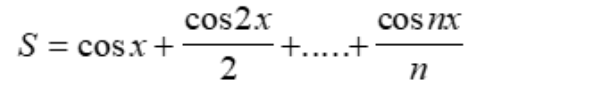

# Сумма ряда

## 3 вариант

Приближенно вычислить значение функции двумя способами:

1) Через сумму функционального ряда с помощью рекурсивной функции. Аргументы функции — n и x, где n — количество членов ряда, x — переменная. 
2) Через прямое вычисление значения функции. Аргумент функции — переменная x.

Сравнить полученные результаты

